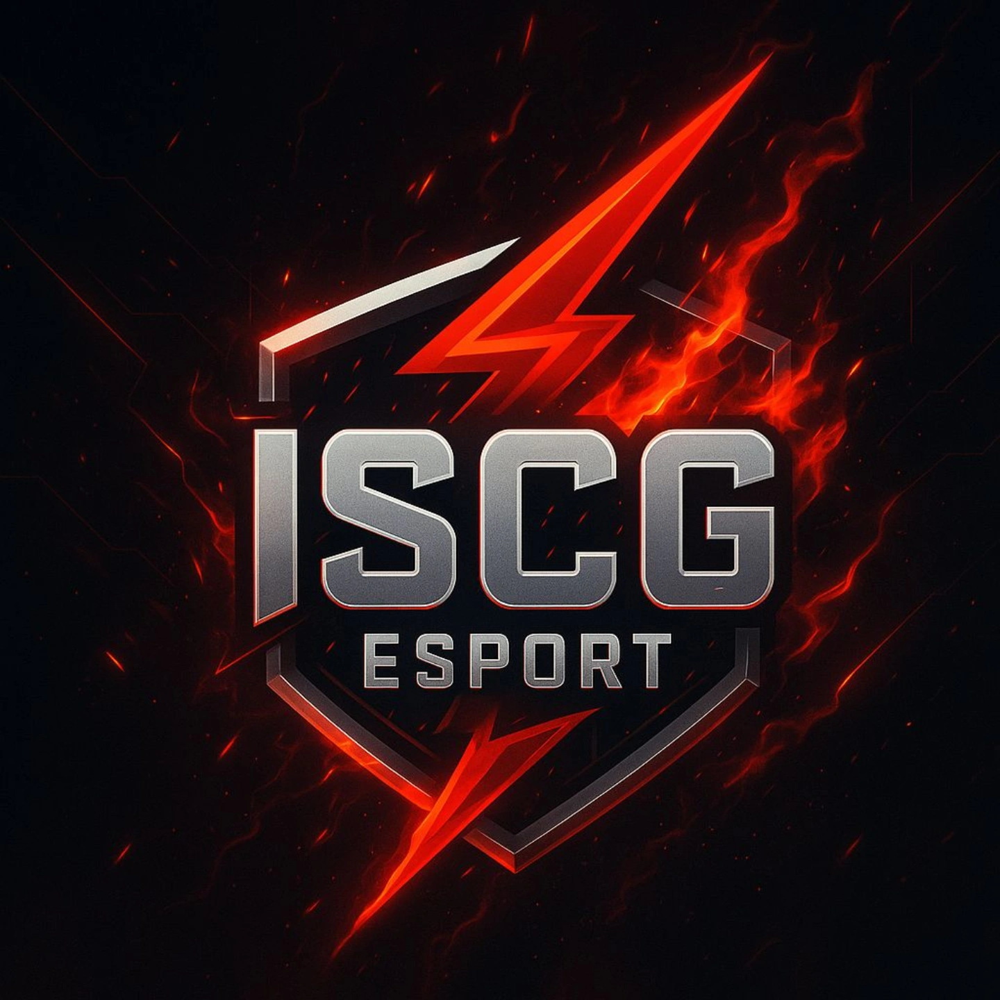

<html lang="zh-TW">
<head>
  <meta charset="UTF-8" />
  <meta name="viewport" content="width=device-width, initial-scale=1.0">
  <title>ISCG-Esport</title>
  
</head>
<body>

  

    
    <h1>ISCG ESport</h1>
    
請輸入戰隊專屬密碼以檢視群組資訊：

    <input type="password" id="password" placeholder="請輸入 密碼">
     
    <button onclick="verifyPassword()">確認</button>
  

  <button id="save-button" onclick="saveChanges()">儲存變更</button>  

    <h2>戰隊公告</h2>
    
公告...

  
  

    <h2>戰隊群組連結</h2>
    <ul>
      <li> <a href="https://discord.gg/fanQdSv4PK" target="_blank">Discord 戰隊群</a></li>
      <li> <a href="https://vt.tiktok.com/ZSHXGFkaU48Jg-cZ9XU/" target="_blank">TikTok 戰隊群</a></li>
      <li> <a href="https://ig.me/j/AbbADUNsweizIrmP/" target="_blank">Instagram 戰隊群</a></li>
      <li> <a href="https://line.me/ti/g2/uuB5tqIRcczDqiSbY57qsRRdZw52yvSCnhbJxQ?utm_source=invitation&utm_medium=link_copy&utm_campaign=default" target="_blank">Line 戰隊群</a></li>
    </ul>
  
  

    <h2>贊助名單（50鑽凝膠）</h2>
    <ul id="sponsor-list" class="editable">
      <li>烤雞 ： 50</li>
      <li>YT：FF電玩 ： 50</li>
      <li>玩家？</li>
    </ul>
  
  

    <h2>排行榜</h2>
    <label for="regionSelect">🌍 選擇區域：</label>
    <select id="regionSelect"></select>
    

      <button onclick="loadLeaderboard('br')">Battle Royale</button>
      <button onclick="loadLeaderboard('cs')">Clash Squad</button>
      <button onclick="loadLeaderboard('bp')">Booyah Pass</button>
    

    <h3 id="modeTitle">請選擇排行榜模式</h3>
    
尚未載入資料。

  

</body>
</html>
